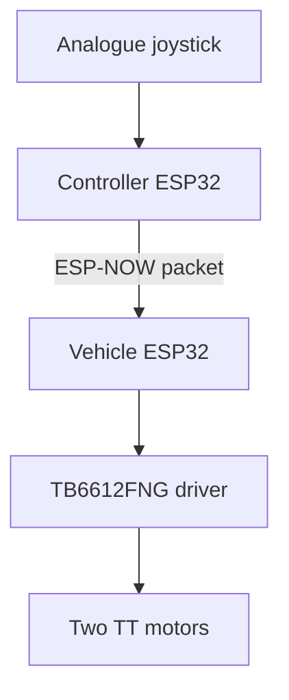
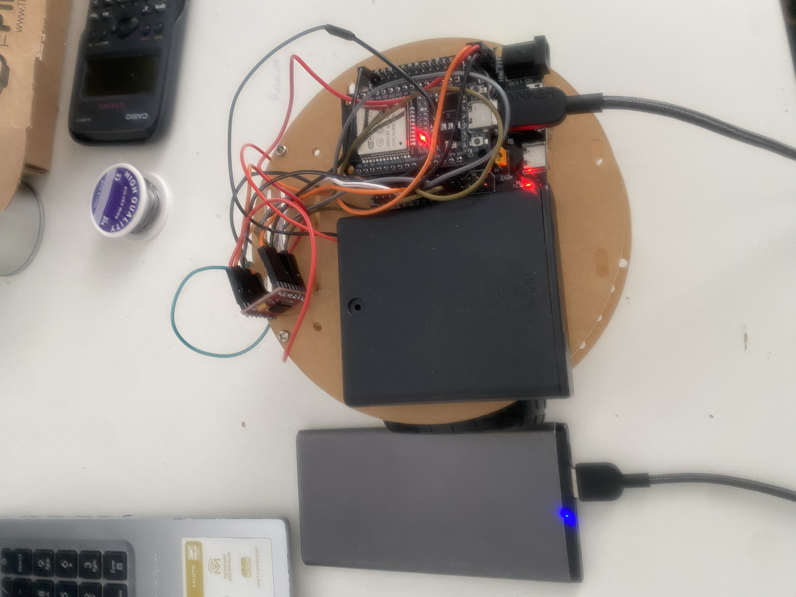
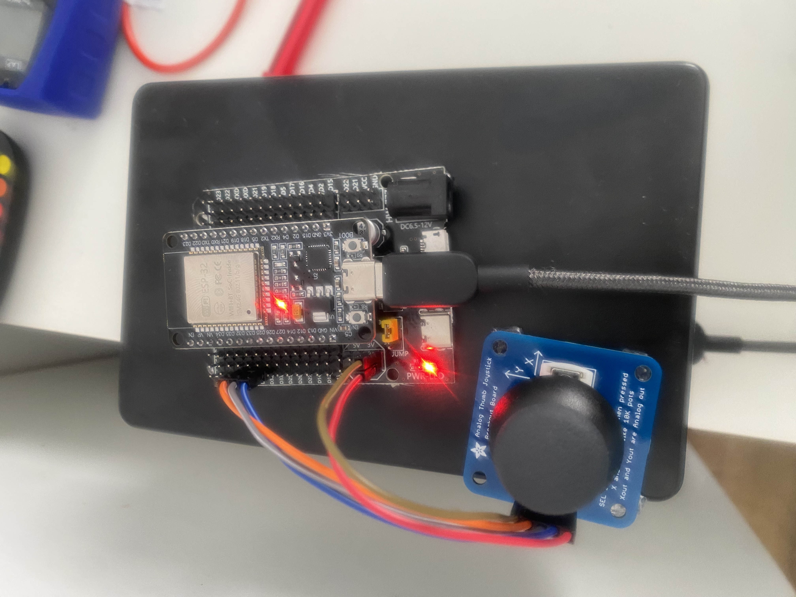
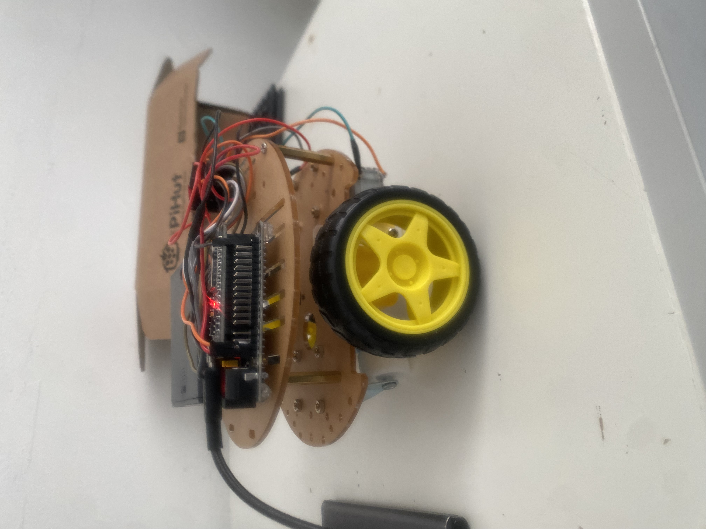

# ESP32 Wireless RC Vehicle

A two-ESP32 remote-controlled vehicle built to develop practical embedded
systems, electronics, wireless communication and hardware-debugging skills.
The handheld controller reads an analogue joystick and sends movement
commands over ESP-NOW. The vehicle ESP32 controls two TT motors through a
TB6612FNG dual motor driver.

## Version 1 status

Version 1 is functionally complete and has been demonstrated indoors. It uses
open-loop motor control; encoder feedback and a custom PCB are planned future
improvements rather than requirements for this release.

## Features

- Handheld two-axis analogue joystick controller
- Forward, backward, left, right and Stop commands
- Push-down joystick Stop control
- Automatic Stop for centred, diagonal or unrecognised joystick positions
- Direct ESP-NOW communication between two ESP32 boards
- Structured command packets containing command, speed and sequence number
- Independently calibrated left/right straight-line motor speeds
- TB6612FNG dual H-bridge motor control
- Two-second wireless command-loss failsafe
- Portable USB power for the controller and vehicle electronics

## System architecture



## Hardware

- 2 × ESP32 development boards
- Adafruit two-axis analogue thumb joystick with Select button
- TB6612FNG dual DC motor driver
- 2 × TT geared DC motors and wheels
- Two-wheel robot chassis and caster
- 4 × AA motor battery supply
- USB power banks for the ESP32 boards
- Jumper wiring, headers and soldered connections
- Handheld controller enclosure

## Connections

The full wiring tables and power notes are in
[`docs/pin_connections.md`](docs/pin_connections.md).

### Controller

| Joystick | ESP32 |
| --- | ---: |
| VCC | 3V3 |
| GND | GND |
| Xout | GPIO34 |
| Yout | GPIO35 |
| Sel | GPIO32 |

### Motor driver control

| TB6612FNG | ESP32 |
| --- | ---: |
| PWMA | GPIO25 |
| AIN1 | GPIO26 |
| AIN2 | GPIO27 |
| STBY | GPIO23 |
| PWMB | GPIO13 |
| BIN1 | GPIO14 |
| BIN2 | GPIO33 |

## Software design

### Controller sender

The sender samples the joystick using the ESP32's 12-bit ADC. Calibrated
thresholds convert the analogue readings into one of five discrete states. A
centred, diagonal or ambiguous position produces a Stop command. The command is
converted into the shared vehicle protocol and transmitted every 50 ms with a
PWM speed value and incrementing sequence number.

### Vehicle receiver

The receiver checks the packet size before copying incoming data. Its main loop
uses a switch statement to translate each command into TB6612FNG direction and
PWM signals. Calibrated straight-line PWM values compensate for physical
differences between the two open-loop motors.

If the vehicle is moving and receives no new movement command for two seconds, it
automatically brakes both motors.

A detailed explanation is available in
[`docs/code_walkthrough.md`](docs/code_walkthrough.md).

## Repository structure

```text
firmware/
  controller_sender/     Handheld-controller firmware
  vehicle_receiver/      Vehicle and motor-control firmware
docs/
  code_walkthrough.md
  pin_connections.md
  test_results.md
assets/
  images/
  demo/
```

## Testing

The completed system passed indoor tests for all four directions, neutral Stop,
push-button Stop and communication-loss failsafe behaviour. Reliable control was
observed across approximately 4 m in a living room. This is a tested indoor
operating distance, not a claim about maximum ESP-NOW range.

See [`docs/test_results.md`](docs/test_results.md) for the acceptance-test table
and limitations.

## Development and problem solving

Key challenges included:

- Installing the ESP32 USB/serial driver and resolving initial upload failures
- Calibrating unequal TT motors for straighter open-loop movement
- Measuring joystick centre variation and selecting safe direction thresholds
- Correcting Select-button wiring and active-low input behaviour
- Keeping both ESP32 radios on the same Wi-Fi channel
- Adding a command-loss timeout so movement cannot continue indefinitely
- Integrating the joystick sender with the vehicle's motor-control program

## Running the project

1. Install ESP32 board support in the Arduino IDE.
2. Connect the vehicle ESP32 and upload
   `firmware/vehicle_receiver/VehicleReceiver.ino`.
3. Update `VEHICLE_MAC` in the controller sketch if the vehicle ESP32 changes.
4. Connect the controller ESP32 and upload
   `firmware/controller_sender/ControllerSender.ino`.
5. Confirm both devices use ESP-NOW channel 1.
6. Raise the vehicle wheels for the first test, then power the controller.
7. Verify Stop and communication-loss behaviour before floor operation.

The callback API signatures match the ESP32 Arduino core used during
development. Other core releases may expose different ESP-NOW callback
signatures.

## Demonstration

A final demonstration video was recorded. It will be added to `assets/demo/`
or linked here as project evidence.

## Project photos

### Vehicle



### Handheld controller



### Vehicle electronics



## Skills demonstrated

- Embedded C++ program structure and enumerations
- GPIO, ADC, PWM and active-low digital inputs
- ESP-NOW peer-to-peer wireless communication
- Dual H-bridge motor control
- Hardware assembly, soldering and multimeter testing
- Calibration, fault isolation and safety-oriented failsafe design
- Technical documentation and version-controlled project organisation

## Future improvements

- Wheel encoders and closed-loop speed control
- Custom ESP32 vehicle PCB
- Sender-MAC validation and optional ESP-NOW encryption
- Battery-voltage monitoring
- Formal outdoor range and battery-runtime testing
- Refined mechanical mounting and enclosure finishing

## Licence

This project is released under the MIT License.
